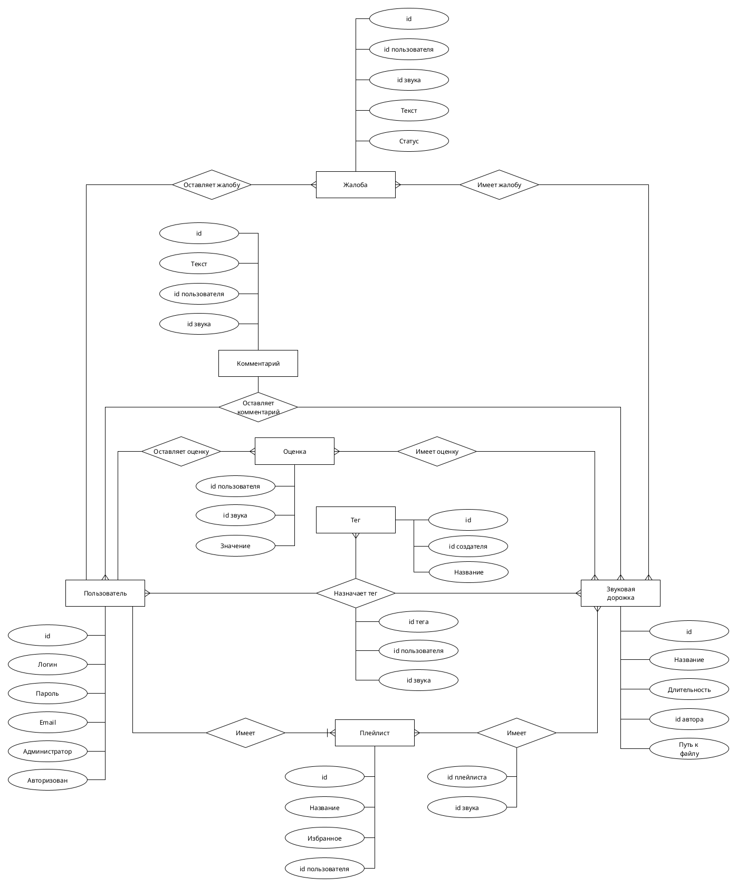
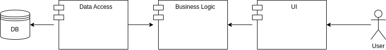

# 1\. Название проекта

MewingPad

# 2\. Краткое описание идеи проекта

Сайт для просмотра списка звуковых дорожек (с тегами) с воспроизведением. Сайт должен предоставлять возможности регистрации пользователей, поиска звуков по тегам/названиям, прослушивания и скачивания звуков. Также должна быть опция добавления в избранное.

# 3\. Краткое описание предметной области

В современном мире общение в реальности часто может дополняться или даже заменяться общением в текстовых или голосовых чатах. В последнее время в голосовых чатах получает распространение использование звуковых дорожек, в основном мемных, через такие средства как саундборд Discord или Soundpad. Благодаря этому можно поднять командный дух во время тяжелой игровой сессии или просто разбавить общение, поэтому библиотеки для коротких звуковых дорожек достаточно востребованы.

# 4\. Краткий анализ аналогичных решений по минимум 3 критериям

Решение                                      | Тегирование звуков | Поиск по тегам | Добавление в избранное
-------------------------------------------- | ------------------ | -------------- | ----------------------
[meowpad](https://meowpad.me/ru-ru/)         | +                  | -              | +                      |
[soundpad-soft](https://soundpad-soft.ru/)   | -                  | +              | -                      |
[zvukogram](https://zvukogram.com/category/) | +                  | +              | -                      |
Предлагаемое решение                         | +                  | +              | +                      |

# 5\. Краткое обоснование целесообразности и актуальности проекта

Из всех представленных в пункте 4 аналогичных решений самым популярным и полнофункциональным является сервис MeowPad, однако, хоть данный сервис и предоставляет возможность тегировать звуковые дорожки, поиска по тегам, как такового, нет, хотя эта функция весьма удобна для поиска по определенным тематикам. Мой проект воспроизводит набор основных возможностей обозначенного сервиса и дополняет его.

# 6\. Краткое описание акторов (ролей)

В проекте определены следующие роли:

- Гость -- неавторизованный посетитель сайта.
- Авторизованный пользователь -- пользователь, зарегистрированный в системе и вошедший в нее.
- Администратор -- авторизованный пользователь, имеющий право загружать, редактировать, удалять и тегировать звуки.

# 7\. Use-Case - диаграмма

# 8\. ER-диаграмма сущностей

# 9\. Пользовательские сценарии

**Загрузка звука**

1. Администратор

2. Заходит в систему и авторизуется

3. Выбирает опцию "Загрузить звук"
4. Устанавливает путь к файлу
5. Выбирает действие "Установить название"
6. Устанавливает название
7. Выбирает действие "Установить теги"
8. Поочередно устанавливает теги
9. Выбирает действие "Применить"

**Скачивание звука, найденного по тегу**

1. Гость

2. Заходит в систему

3. Выбирает опцию "Произвести поиск по тегу"
4. Вводит тег
5. Если есть результаты поиска, выбирает звук
6. Выбирает действие "Прослушать"
7. Выбирает действие "Скачать"
8. Выбирает действие "Закончить обзор"

9. Авторизованный пользователь и Администратор

10. Заходит в систему и авторизуется

11. Выбирает опцию "Произвести поиск по тегу"
12. Вводит тег
13. Если есть результаты поиска, выбирает звук
14. Выбирает действие "Прослушать"
15. Выбирает действие "Скачать"
16. Выбирает действие "Закончить обзор"

**Добавление в Избранное и его просмотр**

1. Авторизованный пользователь и Администратор

2. Заходит в систему и авторизуется

3. Выбирает опцию "Просмотреть все звуковые дорожки"
4. Выбирает звук
5. Выбирает действие "Прослушать"
6. Выбирает действие "Добавить в Избранное"
7. Выбирает действие "Закончить обзор"
8. Выбирает опцию "Просмотреть Избранное"
9. Выбирает действие "Закончить обзор"

# 10\. Формализация ключевых бизнес-процессов

  

# 11\. Тип приложения

Web MPA

# 12\. Технологический стек

- Backend: C#
- Frontend: HTML + CSS
- DB: PostgreSQL

# 13\. Верхнеуровневое разбиение на компоненты

# 14\. Диаграмма классов

