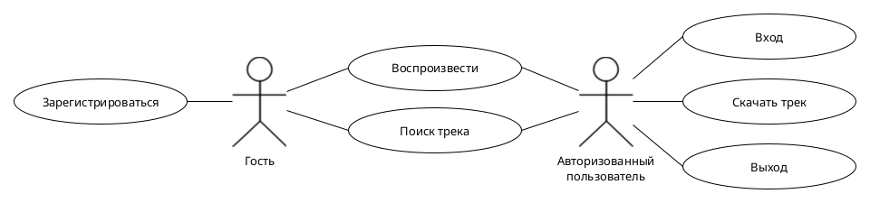
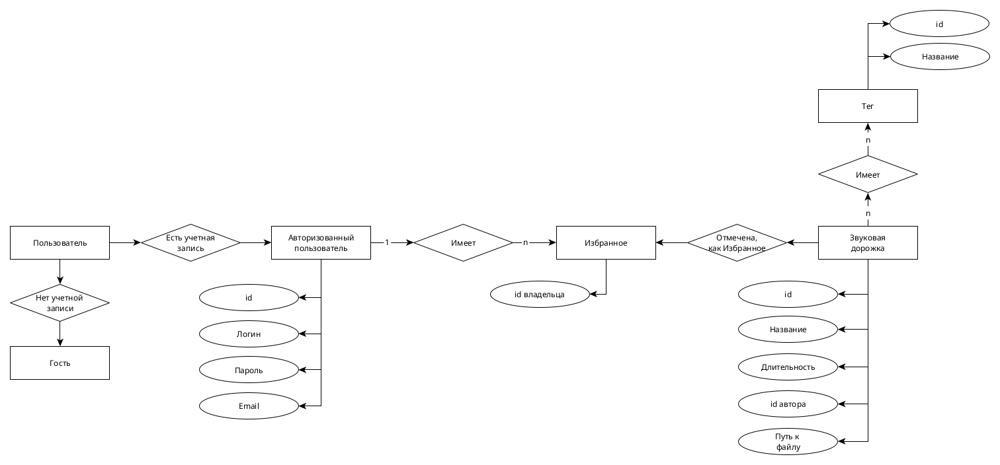
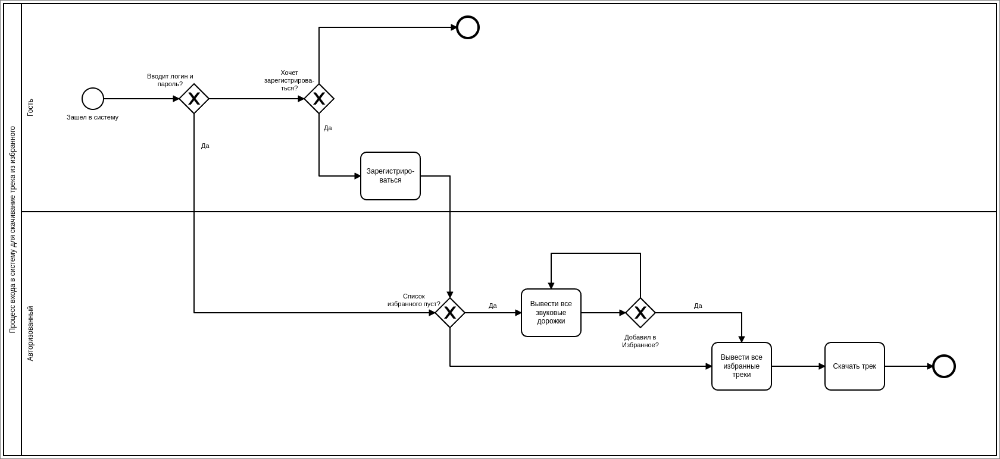
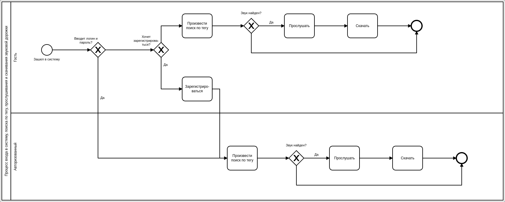

# 1\. Название проекта

MewingPad

# 2\. Краткое описание идеи проекта

Сайт для просмотра списка звуковых дорожек (с тегами) с воспроизведением. Сайт должен предоставлять возможности регистрации пользователей, поиска звуков по тегам/названиям, прослушивания и скачивания звуков. Также должна быть опция добавления в избранное.

# 3\. Краткое описание предметной области

В современном мире общение в реальности часто может дополняться или даже заменяться общением в текстовых или голосовых чатах. В последнее время в голосовых чатах получает распространение использование звуковых дорожек, в основном мемных, через такие средства как саундборд Discord или Soundpad. Благодаря этому можно поднять командный дух во время тяжелой игровой сессии или просто разбавить общение, поэтому библиотеки для коротких звуковых дорожек достаточно востребованы.

# 4\. Краткий анализ аналогичных решений по минимум 3 критериям

Решение                                      | Тегирование звуков | Поиск по тегам | Добавление в избранное
-------------------------------------------- | ------------------ | -------------- | ----------------------
[meowpad](https://meowpad.me/ru-ru/)         | +                  | -              | +                      |
[soundpad-soft](https://soundpad-soft.ru/)   | -                  | +              | -                      |
[zvukogram](https://zvukogram.com/category/) | +                  | +              | -                      |
Предлагаемое решение                         | +                  | +              | +                      |

# 5\. Краткое обоснование целесообразности и актуальности проекта
Из всех представленных в пункте 4 аналогичных решений самым популярным и полнофункциональным является сервис MeowPad, однако, хоть данный сервис и предоставляет возможность тегировать звуковые дорожки, поиска по тегам, как такового, нет, хотя эта функция весьма удобна для поиска по определенным тематикам. Мой проект воспроизводит набор основных возможностей обозначенного сервиса и дополняет его.

# 6\. Краткое описание акторов (ролей)

В проекте определены следующие роли:

- Гость -- неавторизованный посетитель сайта.
- Авторизованный пользователь -- пользователь, зарегистрированный в системе и вошедший в нее.

# 7\. Use-Case - диаграмма

# 8\. ER-диаграмма сущностей

# 9\. Пользовательские сценарии

1) Пользователь заходит в систему как гость, скачивает звуковую дорожку.
2) Пользователь заходит в систему и регистрируется.
3) Пользователь авторизуется в системе со своими логином и паролем; выполняет поиск по тегу трека и скачивает его.
4) Пользователь авторизуется в системе со своими логином и паролем; выполняет поиск по названию трека и добавляет его в избранное.
5) Пользователь авторизуется в системе со своими логином и паролем; воспроизводит звук.

# 10\. Формализация ключевых бизнес-процессов

